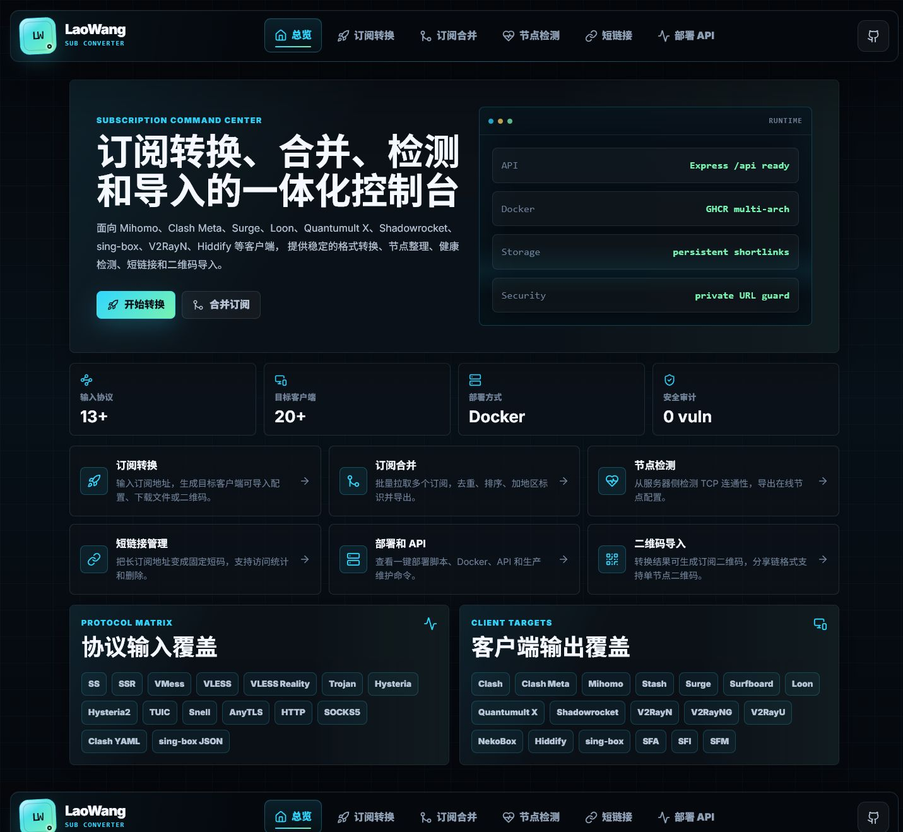
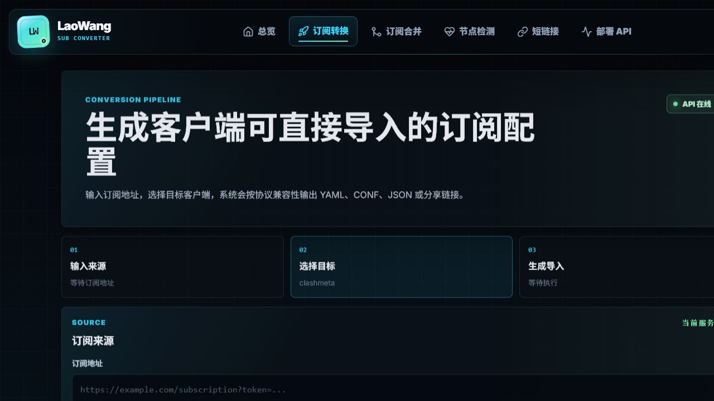
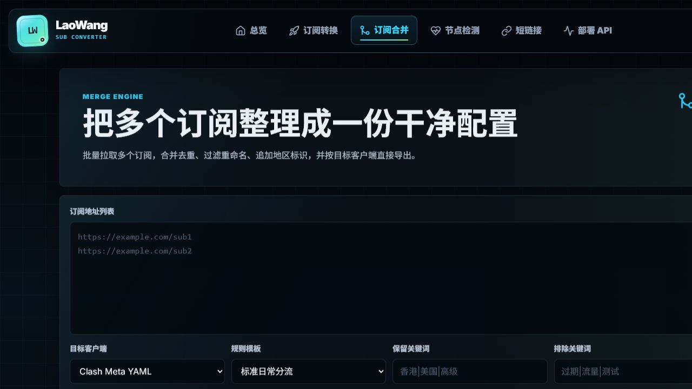
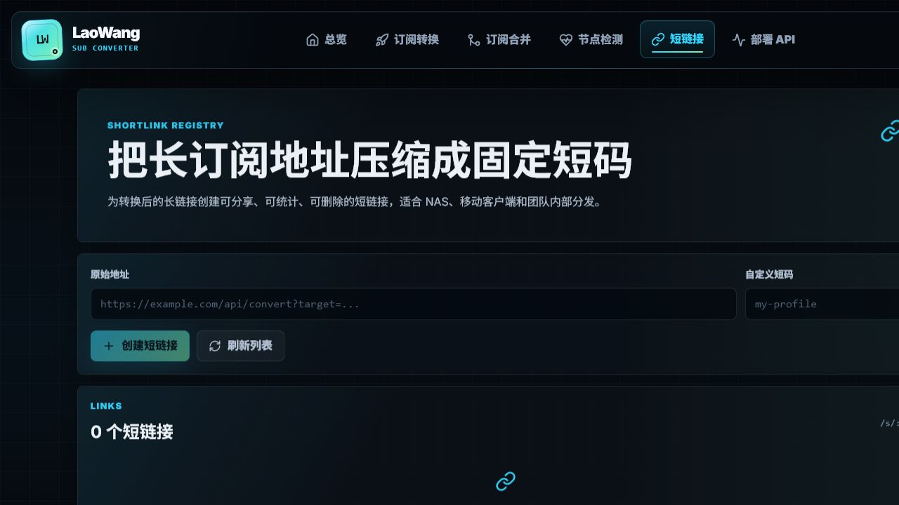

# LaoWang Sub Converter

一个面向自托管场景的代理订阅转换、合并、检测与分发平台。项目提供 Vue 控制台、Node.js API、持久化短链接以及适用于 `linux/amd64`、`linux/arm64` 的生产 Docker 镜像。

[](https://github.com/tony-wang1990/laowang-sub-converter/actions/workflows/docker-publish.yml)
[](https://github.com/tony-wang1990/laowang-sub-converter/pkgs/container/laowang-sub-converter)
[](package.json)
[](LICENSE)

## 项目截图

### 总览



<details>
<summary>查看更多界面</summary>

### 订阅转换



### 订阅合并



### 短链接管理



</details>

## 核心功能

- **订阅转换**：输入订阅地址，生成 YAML、JSON、CONF 或分享链接。
- **订阅合并**：批量拉取最多 20 个订阅，支持精确去重、排序、关键词过滤、重命名和地区标识。
- **客户端兼容过滤**：按目标客户端实际支持范围输出节点；没有兼容节点时返回明确错误，不生成空配置。
- **节点检测**：从部署服务器检测节点 TCP 连通性与延迟，并导出在线节点。
- **短链接管理**：为长订阅地址生成固定短码，支持访问次数统计、列表管理和删除。
- **二维码导入**：转换结果可生成订阅二维码；分享链接格式可按节点生成二维码。
- **规则模板**：为 YAML 客户端提供基础、标准、开发、游戏和流媒体规则模板。
- **生产部署**：提供非 root 容器、只读文件系统、健康检查、持久化数据目录和多架构镜像。

## 协议与客户端

### 输入协议

| 类型 | 支持 |
| --- | --- |
| Shadowsocks | SS、simple-obfs 插件 |
| ShadowsocksR | SSR |
| V2Ray/Xray | VMess、VLESS、VLESS Reality、Trojan |
| QUIC/新协议 | Hysteria、Hysteria2、TUIC、AnyTLS |
| 其他代理 | Snell、HTTP、SOCKS5 |
| 结构化配置 | Clash/Mihomo YAML、sing-box JSON |

### 输出目标

| 配置体系 | 客户端 |
| --- | --- |
| YAML | Clash、Clash Meta、Mihomo、Stash、Clash Verge、Clash Nyanpasu、FlClash |
| sing-box JSON | sing-box、Hiddify、NekoBox、SFA、SFI、SFM |
| CONF/文本 | Surge、Surfboard、Loon、Quantumult X |
| 分享链接/Base64 | Shadowrocket、V2RayN、V2RayNG、V2RayU |

不同客户端并不支持完全相同的协议。项目维护统一兼容矩阵，并为 Mihomo、Stash、Surge、Surfboard、Quantumult X、Loon 和 sing-box 使用各自字段格式。

## 快速部署

### 系统要求

- Linux 服务器：Ubuntu、Debian、Rocky Linux、AlmaLinux、CentOS 等
- `amd64` 或 `arm64`
- 对外开放一个 TCP 端口，默认 `3000`
- root 权限或可使用 `sudo`

### 一键安装

```bash
curl -fsSL "https://raw.githubusercontent.com/tony-wang1990/laowang-sub-converter/main/scripts/deploy.sh?$(date +%s)" | sudo bash
```

脚本会自动安装或使用 Docker，拉取生产镜像，创建持久化目录并等待健康检查。

默认配置：

| 项目 | 默认值 |
| --- | --- |
| 镜像 | `ghcr.io/tony-wang1990/laowang-sub-converter:latest` |
| 安装目录 | `/opt/laowang-sub-converter` |
| 数据目录 | `/opt/laowang-sub-converter/data` |
| 宿主机端口 | `3000` |
| 容器用户 | `10001:10001` |

安装完成后访问：

```text
http://服务器公网IP:3000
```

健康检查：

```bash
curl http://127.0.0.1:3000/healthz
```

正常响应：

```json
{"status":"ok","timestamp":"2026-01-01T00:00:00.000Z"}
```

### 自定义端口

例如使用宿主机 `8080`：

```bash
curl -fsSL "https://raw.githubusercontent.com/tony-wang1990/laowang-sub-converter/main/scripts/deploy.sh?$(date +%s)" |
  sudo env PORT=8080 bash
```

同时需要在云服务器安全组和系统防火墙中放行对应端口。

### 更新

```bash
curl -fsSL "https://raw.githubusercontent.com/tony-wang1990/laowang-sub-converter/main/scripts/deploy.sh?$(date +%s)" |
  sudo bash -s update
```

也可以在安装目录手动更新：

```bash
cd /opt/laowang-sub-converter
docker compose pull
docker compose up -d --force-recreate
docker compose ps
curl http://127.0.0.1:3000/healthz
```

### 状态、日志与卸载

```bash
# 查看状态
curl -fsSL "https://raw.githubusercontent.com/tony-wang1990/laowang-sub-converter/main/scripts/deploy.sh?$(date +%s)" |
  sudo bash -s status

# 实时日志
curl -fsSL "https://raw.githubusercontent.com/tony-wang1990/laowang-sub-converter/main/scripts/deploy.sh?$(date +%s)" |
  sudo bash -s logs

# 删除容器，保留短链接数据
curl -fsSL "https://raw.githubusercontent.com/tony-wang1990/laowang-sub-converter/main/scripts/deploy.sh?$(date +%s)" |
  sudo bash -s uninstall
```

## Docker Compose 部署

创建 `docker-compose.yml`：

```yaml
services:
  laowang-sub-converter:
    image: ghcr.io/tony-wang1990/laowang-sub-converter:latest
    container_name: laowang-sub-converter
    environment:
      NODE_ENV: production
      PORT: 3000
      DATA_DIR: /app/data
      ALLOW_PRIVATE_SUBSCRIPTION_URLS: "0"
      PUBLIC_BASE_URL: ""
    ports:
      - "3000:3000"
    volumes:
      - ./data:/app/data
    restart: unless-stopped
    read_only: true
    tmpfs:
      - /tmp
    security_opt:
      - no-new-privileges:true
```

准备数据目录并启动：

```bash
mkdir -p data
sudo chown -R 10001:10001 data
sudo chmod 750 data

docker compose pull
docker compose up -d
docker compose ps
```

如果使用仓库自带的 `docker-compose.yml`，数据会保存在 Docker 命名卷 `laowang-data` 中。

## Docker CLI 部署

```bash
sudo install -d -m 750 -o 10001 -g 10001 /opt/laowang-sub-converter/data

docker run -d \
  --name laowang-sub-converter \
  -p 3000:3000 \
  -e NODE_ENV=production \
  -e PORT=3000 \
  -e DATA_DIR=/app/data \
  -v /opt/laowang-sub-converter/data:/app/data \
  --read-only \
  --tmpfs /tmp \
  --security-opt no-new-privileges:true \
  --restart unless-stopped \
  ghcr.io/tony-wang1990/laowang-sub-converter:latest
```

## HTTPS 与反向代理

推荐使用 Nginx Proxy Manager、Caddy 或 Nginx 为服务配置域名和 HTTPS。

### Nginx Proxy Manager

新建 Proxy Host：

| 配置 | 值 |
| --- | --- |
| Scheme | `http` |
| Forward Hostname/IP | Docker 宿主机 IP |
| Forward Port | `3000` |
| Websockets Support | 可开启 |
| Block Common Exploits | 建议开启 |
| SSL | 申请证书并启用 Force SSL |

使用域名时设置 `PUBLIC_BASE_URL`，确保生成的短链接使用正确 HTTPS 地址：

```bash
curl -fsSL "https://raw.githubusercontent.com/tony-wang1990/laowang-sub-converter/main/scripts/deploy.sh?$(date +%s)" |
  sudo env PUBLIC_BASE_URL=https://sub.example.com bash
```

已有部署也可以编辑 `/opt/laowang-sub-converter/docker-compose.yml`：

```yaml
environment:
  PUBLIC_BASE_URL: "https://sub.example.com"
```

然后重建容器：

```bash
cd /opt/laowang-sub-converter
docker compose up -d --force-recreate
```

## 环境变量

| 变量 | 默认值 | 说明 |
| --- | --- | --- |
| `PORT` | `3000` | 容器内服务监听端口 |
| `DATA_DIR` | `/app/data` | 短链接数据目录 |
| `PUBLIC_BASE_URL` | 空 | 生成短链接时使用的公网根地址 |
| `TRUST_PROXY` | `1` | Express 信任的反向代理跳数或规则 |
| `ALLOW_PRIVATE_SUBSCRIPTION_URLS` | `0` | 是否允许后端访问 localhost、内网 IP 和 `.local` 域名 |

默认禁止私有地址可降低公开部署时的 SSRF 风险。仅在可信内网、自用部署且确实需要拉取内网订阅时启用：

```bash
curl -fsSL "https://raw.githubusercontent.com/tony-wang1990/laowang-sub-converter/main/scripts/deploy.sh?$(date +%s)" |
  sudo env ALLOW_PRIVATE_SUBSCRIPTION_URLS=1 bash
```

## 数据与备份

短链接保存在：

```text
/app/data/shortlinks.json
```

一键脚本部署时对应宿主机文件：

```text
/opt/laowang-sub-converter/data/shortlinks.json
```

备份：

```bash
sudo cp -a /opt/laowang-sub-converter/data \
  "/opt/laowang-sub-converter/data-backup-$(date +%Y%m%d-%H%M%S)"
```

请勿让数据目录归 `root:root`，容器使用 UID/GID `10001:10001`。出现短链接存储错误时执行：

```bash
sudo chown -R 10001:10001 /opt/laowang-sub-converter/data
sudo chmod 750 /opt/laowang-sub-converter/data
```

## API

### 订阅转换

```http
GET /api/convert?target=clashmeta&url=https%3A%2F%2Fexample.com%2Fsub
```

常用参数：

| 参数 | 说明 |
| --- | --- |
| `target` | 目标客户端，例如 `clashmeta`、`mihomo`、`singbox`、`surge`、`v2rayn` |
| `url` | URL 编码后的订阅地址 |
| `emoji` | 是否添加地区标识，`1` 或 `0` |
| `udp` | 是否启用 UDP，`1` 或 `0` |
| `scert` | 是否跳过证书校验，`1` 或 `0` |
| `sort` | 是否按节点名称排序，`1` 或 `0` |
| `include` | 仅保留匹配关键词的节点，多个关键词使用 `\|` 分隔 |
| `exclude` | 排除匹配关键词的节点，多个关键词使用 `\|` 分隔 |
| `rename` | 重命名规则，例如 `旧名称->新名称` |
| `rulePreset` | `basic`、`standard`、`developer`、`gaming`、`streaming` |

### 订阅合并

```http
POST /api/merge
Content-Type: application/json

{
  "urls": [
    "https://example.com/sub1",
    "https://example.com/sub2"
  ],
  "target": "clashmeta",
  "dedupe": true,
  "emoji": true,
  "sort": false,
  "rulePreset": "standard"
}
```

预览节点：

```http
POST /api/merge/preview
```

### 节点检测

```http
POST /api/health/check
Content-Type: application/json

{
  "url": "https://example.com/sub",
  "timeout": 5000,
  "concurrent": 10,
  "exportTarget": "v2rayn"
}
```

也可以提交原始节点内容：

```json
{
  "content": "ss://...\nvmess://...",
  "exportTarget": "clashmeta"
}
```

### 短链接

```http
POST /api/shortlink
Content-Type: application/json

{
  "url": "https://example.com/api/convert?target=clashmeta&url=...",
  "code": "my-profile"
}
```

其他接口：

```http
GET    /api/shortlink/list
GET    /api/shortlink/:code/stats
DELETE /api/shortlink/:code
GET    /api/targets
GET    /api/rules/presets
GET    /healthz
```

## 本地开发

要求 Node.js `>=20.19.0`。

安装依赖：

```bash
npm ci
```

开发模式需要分别启动后端和 Vite：

```bash
# 终端 1
npm run server

# 终端 2
npm run dev
```

生产模式：

```bash
npm run build
NODE_ENV=production npm run server
```

Windows PowerShell：

```powershell
npm run build
$env:NODE_ENV = "production"
npm run server
```

## 测试与质量门禁

```bash
npm test
npm run build
npm run audit
```

自动化测试覆盖：

- 21 个目标客户端的协议兼容矩阵
- SS、SSR、VMess、VLESS/Reality、Trojan、Hysteria、TUIC、AnyTLS 等解析与输出
- 转换、合并、节点检测和短链接 API
- 短链接持久化、HTTPS 反向代理地址和访问统计
- 私有地址与 IPv4-mapped IPv6 SSRF 防护
- Docker 运行时文件、数据权限与安全配置
- 前端错误信息和生产构建

推送到 `main` 后，GitHub Actions 会运行测试、构建和审计，并发布：

```text
ghcr.io/tony-wang1990/laowang-sub-converter:latest
ghcr.io/tony-wang1990/laowang-sub-converter:main
ghcr.io/tony-wang1990/laowang-sub-converter:sha-xxxxxxx
```

## 常见问题

### 浏览器提示连接被拒绝

```bash
docker compose ps
ss -lntp | grep :3000
curl http://127.0.0.1:3000/healthz
```

确认 Compose 的 `PORTS` 列包含：

```text
0.0.0.0:3000->3000/tcp
```

并检查云安全组与系统防火墙。

### 容器不断 Restarting

```bash
docker logs --tail=200 laowang-sub-converter
docker inspect laowang-sub-converter \
  --format 'Exit={{.State.ExitCode}} Error={{.State.Error}} Restart={{.RestartCount}}'
```

然后拉取最新镜像：

```bash
cd /opt/laowang-sub-converter
docker compose pull
docker compose up -d --force-recreate
```

### 页面打开后内容空白或菜单无反应

先更新到最新镜像，再强制刷新浏览器：

```bash
cd /opt/laowang-sub-converter
docker compose pull
docker compose up -d --force-recreate
```

浏览器使用 `Ctrl + F5`。当前生产构建将所有页面放入单个压缩 JS 包，页面切换不再额外下载路由分包。

### 短链接列表报错

```bash
sudo chown -R 10001:10001 /opt/laowang-sub-converter/data
sudo chmod 750 /opt/laowang-sub-converter/data
docker restart laowang-sub-converter
```

## 安全说明

- 默认拒绝后端访问 localhost、私有 IP、链路本地地址和保留地址。
- 每次订阅重定向都会重新执行地址检查。
- 订阅响应有超时和大小限制。
- 节点检测限制节点数量、并发数、端口和超时时间。
- 容器默认以非 root 用户运行，使用只读根文件系统和 `no-new-privileges`。
- 这是订阅处理工具，不负责验证节点来源是否合法或可信。请勿处理未知来源的敏感订阅。

## License

[MIT](LICENSE)
